# Foldable Device Support in MAUI

In this demo we will build MAUI apps that take advantage of foldable devices. We'll discover the features (and limitations) of what's available, and attempt stopgap measures where things become impossible. Read On

## Introduction

Foldable phones are coming into their own. These devices fold in the middle, and often have an outer display.  This form factor allows for scenarios and features that are just not possible on a standard single-pane phone. 

To get a sample of what's out there, check out [Tom's Guide to the Best Foldable Phones of 2023](https://www.tomsguide.com/best-picks/best-foldable-phones). The clear winners are the [Samsung Galaxy Z Fold 4](https://www.amazon.com/dp/B0B3T7SPPZ/) and the [Samsung Galaxy Z Flip 4](https://www.amazon.com/dp/B0B3T9LFZQ/).  In this article, Toms also cites the https://www.amazon.com/Microsoft-Surface-Duo-128GB-Unlocked/dp/B09H8ZWQ3V/ and the [Oppo Find N2](https://www.amazon.com/OPPO-Dual-SIM-Factory-Unlocked-Smartphone/dp/B082F1QKHK) (the original Amazon link is broken).

In early 2023 the MAUI team announced the [TwoPaneView for foldable devices](https://learn.microsoft.com/en-us/dotnet/maui/user-interface/controls/twopaneview?view=net-maui-7.0) and I was excited. This simple XAML control contains two child panes and automatically adjusts the orientation of the panes depending on the Mode (Wide or Tall), which you can think of as Landscape or Portrait.

Back in February in preparation for this episode, I purchased a used [Galaxy Z Flip 3](https://www.amazon.com/SAMSUNG-Galaxy-Unlocked-Smartphone-Intuitive/dp/B09G5ZKCXY/) and let it sit on my desk. Now ready to jump in, I followed the instructions in the TwoPaneView documentation, ran it on my Flip3, and... it almost worked. Read on.

## Prerequisites

Before starting this tutorial, you should have some experience with C# and MAUI development. You should be familiar with creating and using controls and layouts in MAUI. If you're new to MAUI development, the [Official MAUI documentation](https://docs.microsoft.com/dotnet/maui/) is a great place to start. Additionally, if you have experience with Xamarin.Forms, it will be helpful in understanding some of the concepts in this tutorial.

To follow along with the demo in this tutorial, you will need:

- A foldable device
- .NET 7 SDK or later
- Visual Studio 2022
- Basic knowledge of C# and XAML

If you don't have experience with Xamarin.Forms, don't worry, as we will be covering everything you need to know about Bindable Properties in MAUI. If you have these prerequisites covered, let's move on to building our demo application.

If you don't have a foldable device, you can still learn a lot from this tutorial, and by watching the video on https://thedotnetshow.com episode 41.

### .NET 7.0

Download the latest version of the .NET 7.0 SDK [here](https://dotnet.microsoft.com/en-us/download).

### Visual Studio 2022

To follow along with this demo, I will be using the latest version of Visual Studio 2022. You can download it [here](https://visualstudio.microsoft.com).

### Required Workloads

To build .NET MAUI applications, you will also need the .NET Multi-platform App UI development workload. If you haven't already installed it, you can do so by following these steps:

1. Open Visual Studio Installer and select "Modify" on your installation.
2. In the "Workloads" tab, select the ".NET Multi-platform App UI development" workload.
3. Click "Modify" to start the installation process.

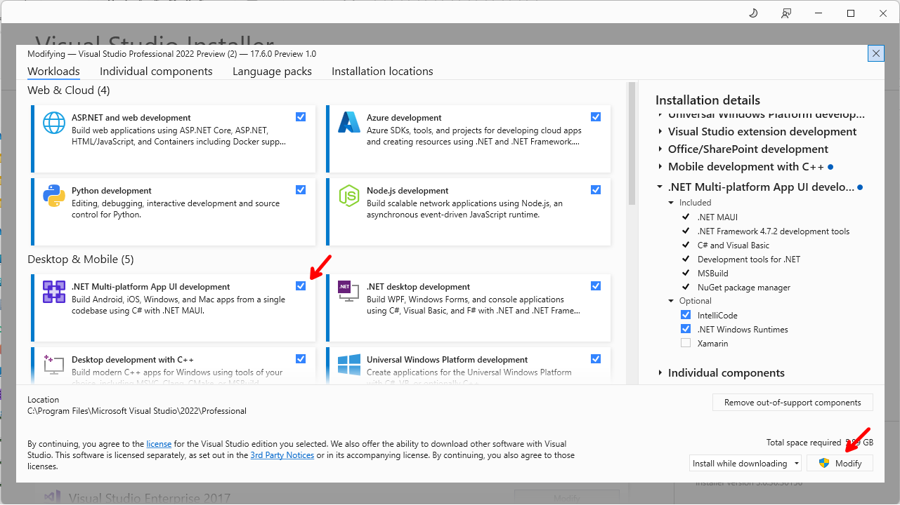  

Once the installation is complete, you're ready to start building your .NET MAUI applications.

## DEMO

To Start, I'm going to build a MAUI XAML app according to the [documentation](https://learn.microsoft.com/en-us/dotnet/maui/user-interface/controls/twopaneview?view=net-maui-7.0) 

Create a new .NET MAUI App called **TwoPaneXAMLDemo**


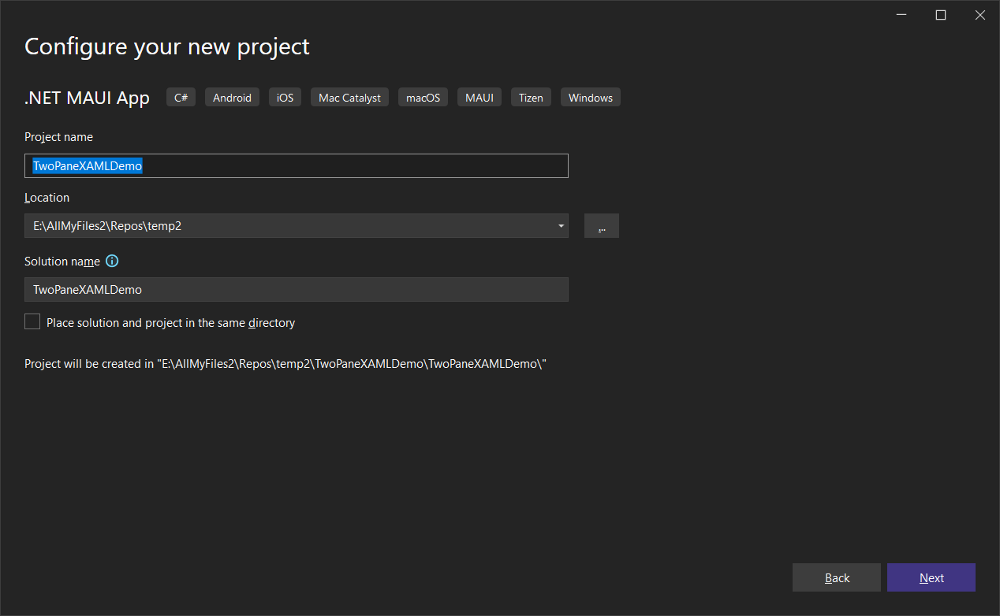


Add the following NuGet package:

```c#
Microsoft.Maui.Controls.Foldable
```

Add the following to the top of *MauiProgram.cs*:

```c#
global using Microsoft.Maui.Foldable;
```

And add this line just before building at line 23:

```c#
builder.UseFoldable();
```

Next, Update the *[Activity]* attribute on the `MainActivity` class in *Platforms/Android*, so that it includes all these `ConfigurationChanges` options:

```c#
ConfigurationChanges = ConfigChanges.Orientation | ConfigChanges.ScreenSize
    | ConfigChanges.ScreenLayout | ConfigChanges.SmallestScreenSize | ConfigChanges.UiMode
```

Here's what I ended up with:

```c#
using Android.App;
using Android.Content.PM;
using Android.OS;

namespace TwoPaneXAMLDemo;

[Activity(Theme = "@style/Maui.SplashTheme", MainLauncher = true,
    ConfigurationChanges = ConfigChanges.Orientation | 
        ConfigChanges.ScreenSize | ConfigChanges.ScreenLayout |
        ConfigChanges.SmallestScreenSize | ConfigChanges.UiMode)]
public class MainActivity : MauiAppCompatActivity
{
}
```

Replace *MainPage.xaml* with the following:

```xaml
<?xml version="1.0" encoding="utf-8" ?>
<ContentPage xmlns="http://schemas.microsoft.com/dotnet/2021/maui"
             xmlns:x="http://schemas.microsoft.com/winfx/2009/xaml"
             xmlns:foldable="clr-namespace:Microsoft.Maui.Controls.Foldable;assembly=Microsoft.Maui.Controls.Foldable"
             x:Class="TwoPaneXAMLDemo.MainPage">

    <foldable:TwoPaneView x:Name="twoPaneView" >
        <foldable:TwoPaneView.Pane1
            BackgroundColor="#dddddd">
            <Label
                Text="Hello, .NET MAUI!"
                SemanticProperties.HeadingLevel="Level1"
                FontSize="32"
                HorizontalOptions="Center" />
        </foldable:TwoPaneView.Pane1>
        <foldable:TwoPaneView.Pane2>
            <StackLayout BackgroundColor="{AppThemeBinding Light={StaticResource Secondary}, Dark={StaticResource Primary}}">
                <Label x:Name="Label2"
                       FontSize="32"
                       HorizontalOptions="Center"
                       VerticalOptions="Center"
                       Text="Pane2 StackLayout"/>
            </StackLayout>
        </foldable:TwoPaneView.Pane2>
    </foldable:TwoPaneView>

</ContentPage>
```

Note that we added the `foldable` namespace at line 4:

```xaml
xmlns:foldable="clr-namespace:Microsoft.Maui.Controls.Foldable;assembly=Microsoft.Maui.Controls.Foldable"
```

Then we define a top-level control, `TwoPaneView`

```xaml
<foldable:TwoPaneView ...
```

Inside that we define `<foldable:TwoPaneView.Pane1>` and `<foldable:TwoPaneView.Pane2>`, our two panes.

Replace *MainPage.xaml.cs* with the following:

```c#
namespace TwoPaneXAMLDemo;

public partial class MainPage : ContentPage
{
    public MainPage()
    {
        InitializeComponent();
        twoPaneView.ModeChanged += TwoPaneView_ModeChanged;
    }

    private void TwoPaneView_ModeChanged(object sender, EventArgs e)
    {
        // The mode changed. 
        Label2.Text = twoPaneView.Mode.ToString();
    }
}
```

In reality, you don't need to add any code for the `TwoPaneView` to automatically change the orientation of your panes between Wide (side-to-side) and Tall (top-and-bottom), but in our case, we're handling the `ModeChanged` event so we can change the Text in `Label2` to show the current mode.

#### Does it work?

I tested it on my Flip3 and observed a strange behavior. 

This is what it looks like when you run it the first time.

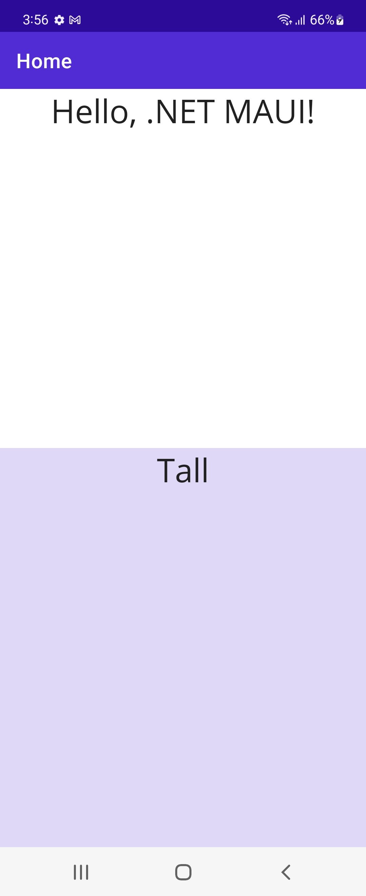

That's the way it should look, except for the fact that Pane1's `BackgroundColor` is not accurately represented. The fold is right in the middle between the two panes. This is Tall mode. 

Next, I rotated my phone 90 degrees and I got this:

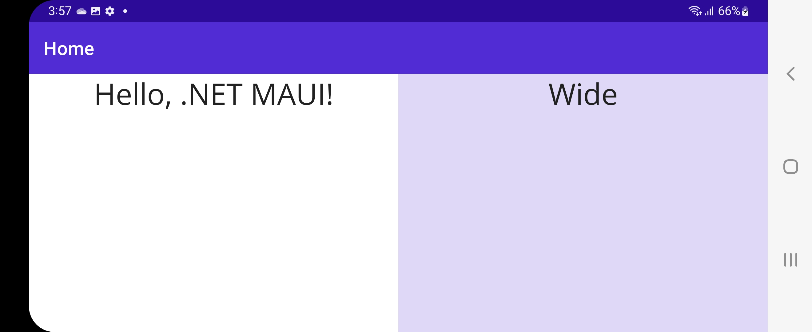

Again, that looks good. Now, here's the strange part. I rotated it back to it's original position, and...

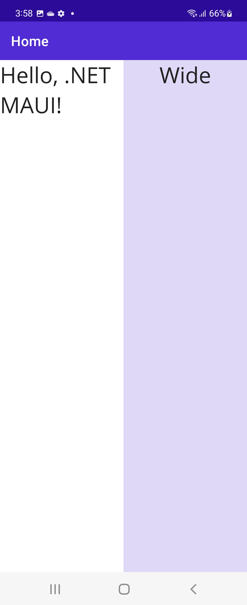

Cue the sad trombones.

At this point I was thinking there's a bug in the MAUI code. Then I realized that this phone (the Flip3) was a generation old. The Flip4 is the current state-of-the-art as of this writing.

So, I went down to Best Buy and picked up a Flip4. I also got a Fold4, it's bigger brother, so I could test them both.

Spoiler alert. The new phones work just fine. You can go back and fourth between Tall and Wide modes without an issue. The BackgroundColor of Pane1 still isn't set to "#dddddd" though. That seems like either  a bug in the demo or in the `TwoPaneView` control.

##### Running the App on a Fold4

The Fold4 is quite an impressive device. [This video](https://www.youtube.com/watch?v=nC0bLKVgOAI) blew my mind. However, the default mode is Wide. That's because the Fold4 is like a book. The fold is down the vertical middle, whereas the Flip's fold is across the horizontal middle, and therefore the default mode is Tall. That has nothing to do with the screen size. Both devices are higher than they are wide. It's just the nature of the devices.

Here's our app running on the Fold4:

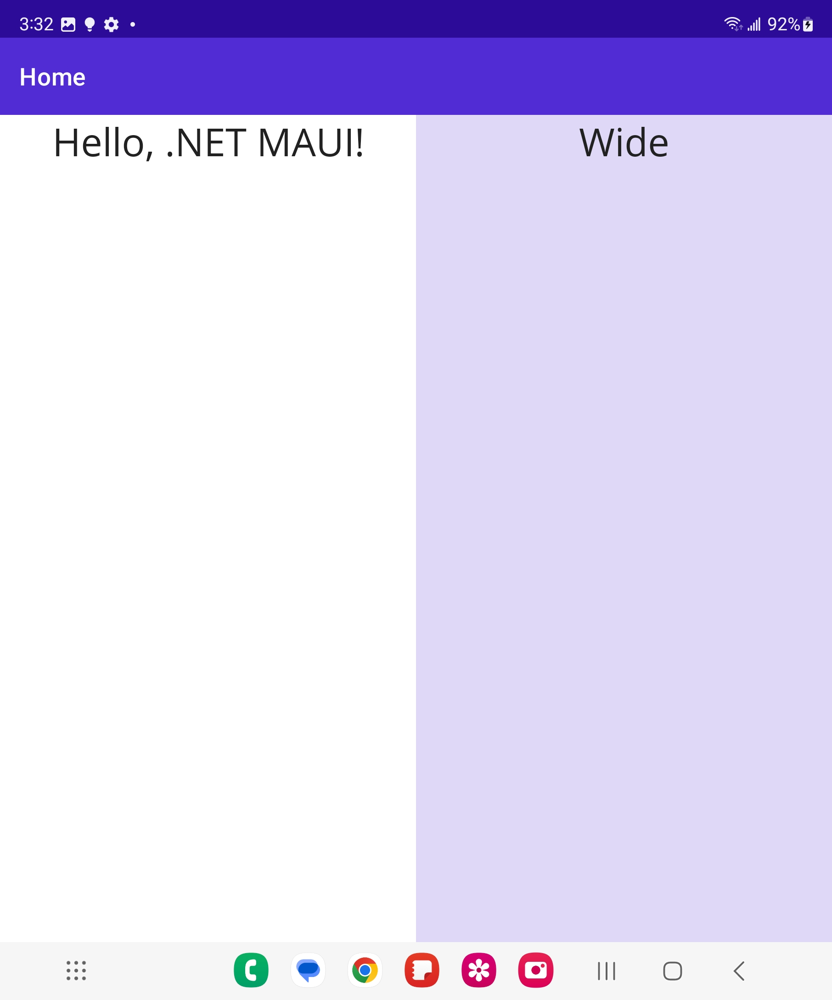

Turning the app 90 degrees puts it in Tall mode:

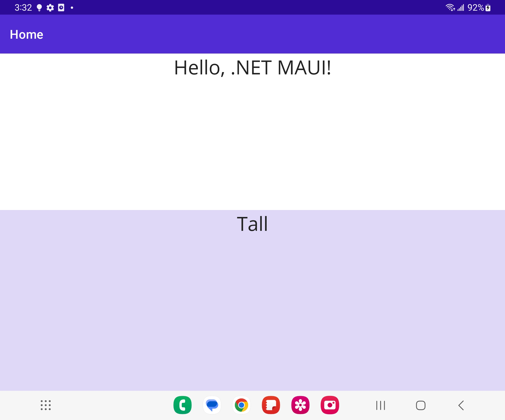

Again, the Background color doesn't translate. 

After looking at the XAML for a minute, I tried using a `StackPanel` with a BackgroundColor for Pane1 just like with Pane2, and that worked.

*MainPage.xaml*:

```xaml
<?xml version="1.0" encoding="utf-8" ?>
<ContentPage xmlns="http://schemas.microsoft.com/dotnet/2021/maui"
             xmlns:x="http://schemas.microsoft.com/winfx/2009/xaml"
             xmlns:foldable="clr-namespace:Microsoft.Maui.Controls.Foldable;assembly=Microsoft.Maui.Controls.Foldable"
             x:Class="TwoPaneXAMLDemo.MainPage">

    <foldable:TwoPaneView x:Name="twoPaneView" >
        <foldable:TwoPaneView.Pane1>
            <StackLayout BackgroundColor="Bisque">
                <Label
                    Text="Hello, .NET MAUI!"
                    SemanticProperties.HeadingLevel="Level1"
                    FontSize="32"
                    HorizontalOptions="Center" />
            </StackLayout>
        </foldable:TwoPaneView.Pane1>
        <foldable:TwoPaneView.Pane2>
            <StackLayout BackgroundColor="{AppThemeBinding Light={StaticResource Secondary}, Dark={StaticResource Primary}}">
                <Label x:Name="Label2"
                       FontSize="32"
                       HorizontalOptions="Center"
                       VerticalOptions="Center"
                       Text="Pane2 StackLayout"/>
            </StackLayout>
        </foldable:TwoPaneView.Pane2>
    </foldable:TwoPaneView>

</ContentPage>
```

Wide Mode:

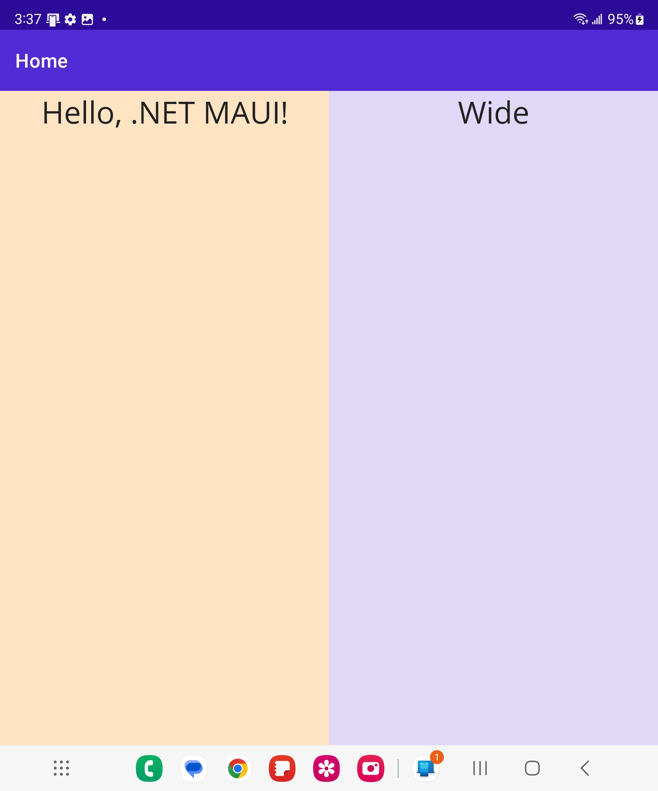

Tall Mode:

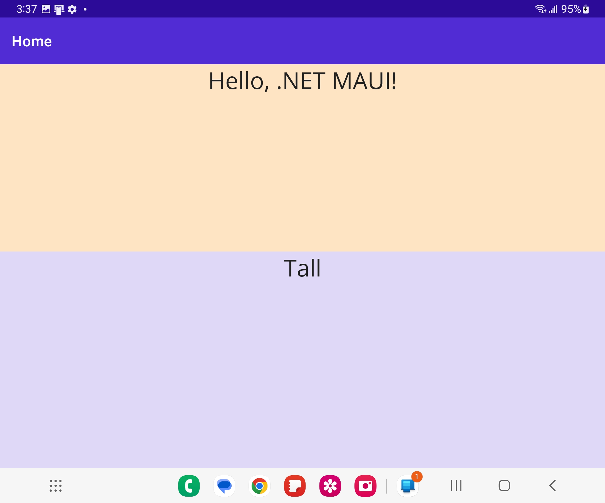

## What about MAUI Blazor?

Straight Up: XAML Controls such as `TwoPaneView` can't be used in MAUI Blazor apps. However, if you think about what this control does: switch the orientation of two panels based on the orientation of the display (Portrait or Landscape), it shouldn't be too hard to write a Blazor Component that does the same thing, right?

So, I gave it a shot. 

Create a new **.NET MAUI Blazor App** called **TwoPanelBlazorDemo**

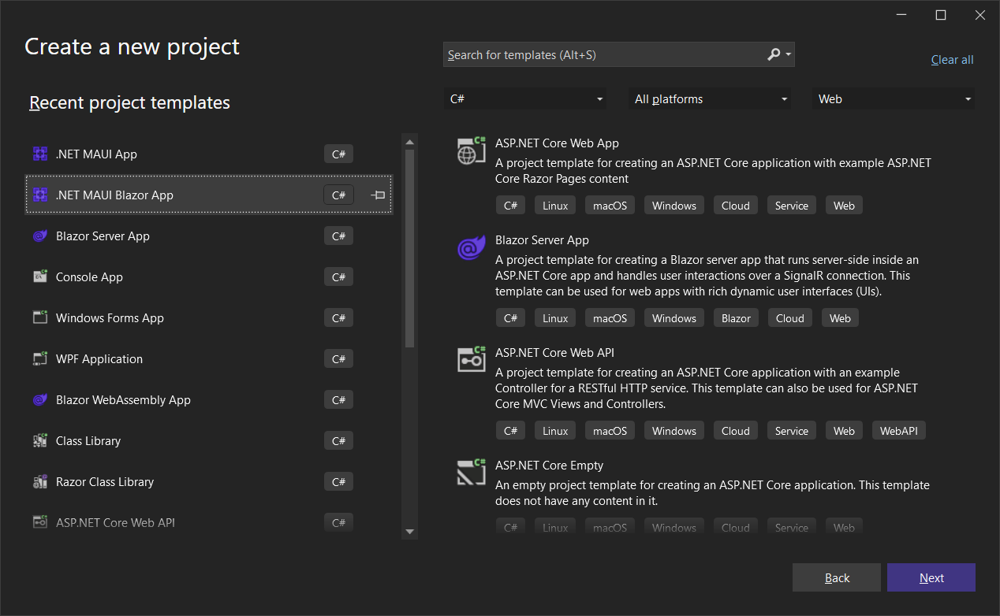

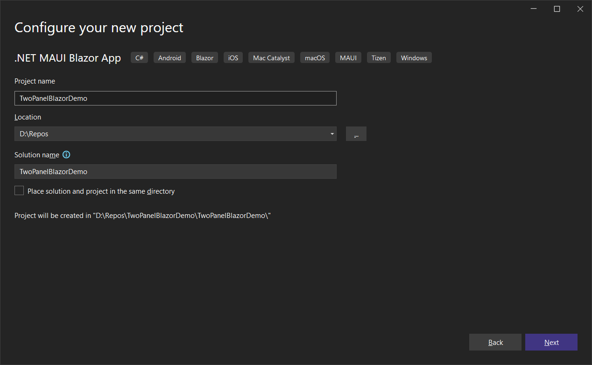

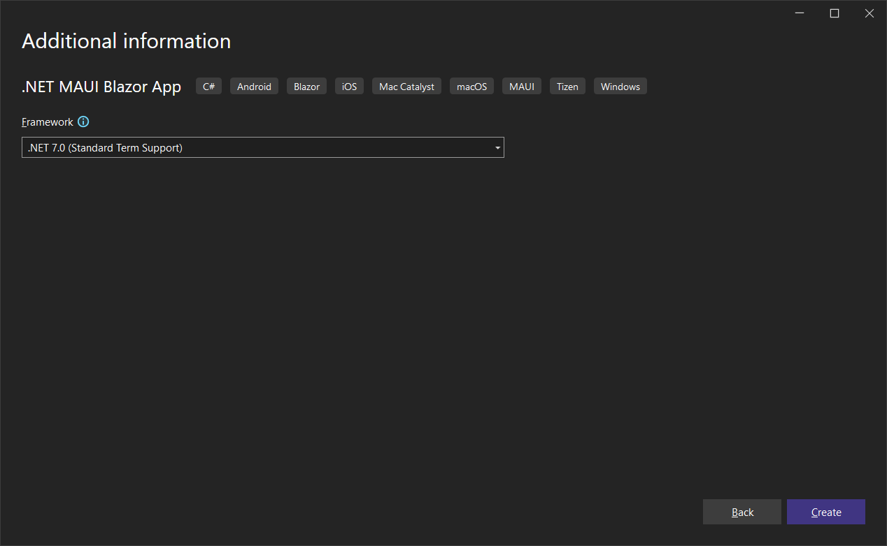

**Clean up Template Files**

Remove the following:

1. The *Data* Folder
2. *Pages/Counter.razor*
3. *Pages/FetchData.razor*
4. *Shared/NavMenu.razor*
5. *Shared/SurveyPrompt.razor*

Change *Shared/MainLayout.razor* to the following:

```
@inherits LayoutComponentBase
@Body
```

Remove lines 2 and 25 from *MauiProgram.cs*:

```c#
using Microsoft.Extensions.Logging;

namespace TwoPanelBlazorDemo;

public static class MauiProgram
{
	public static MauiApp CreateMauiApp()
	{
		var builder = MauiApp.CreateBuilder();
		builder
			.UseMauiApp<App>()
			.ConfigureFonts(fonts =>
			{
				fonts.AddFont("OpenSans-Regular.ttf", "OpenSansRegular");
			});

		builder.Services.AddMauiBlazorWebView();

#if DEBUG
		builder.Services.AddBlazorWebViewDeveloperTools();
		builder.Logging.AddDebug();
#endif


		return builder.Build();
	}
}
```

#### Hacks R Us

I had to implement a janky hack in order to get this to work. In XAML, the `TwoPaneView` control understands the mode because it comes right from the device. In my case, I don't have access to that information. At least, I don't think I do.

So, I created a `MobileDevice` enumeration that I can set to whatever device I'm running on. I can get THAT information easily.

Add the following:

*MobileDevice.cs*:

```c#
public enum MobileDevice
{
    None,
    Flip,
    Fold
}
```

Now, I only have these two devices to test on, and there are more coming down the pipeline for sure. So, this is truly a stop-gap measure. To continue using this method requires constant testing with new and older devices. 

We also need a `Mode` enumeration. Add the following:

*Mode.cs*:

```c#
public enum Mode
{
    None,
    Tall,
    Wide
}
```

Now let's get to the Blazor component. 

To the *Shared* folder, add the following:

*TwoPaneView.razor*:

```c#
@if (Mode == Mode.Wide)
{
    <div class="@Pane1Class" style="width:50vw;float:left;height:100vh;@Pane1Style;">
        @Pane1
    </div>
    <div class="@Pane2Class" style="width:50vw;float:right;height:100vh;@Pane2Style;">
        @Pane2
    </div>
}
else if (Mode == Mode.Tall)
{
    <div class="@Pane1Class" style="width:100vw;height:50vh;@Pane1Style;">
        @Pane1
    </div>
    <div class="@Pane2Class" style="width:100vw;height:50vh;@Pane2Style;">
        @Pane2
    </div>
}
```

Even without the code behind, you can see what we're doing here.

In Wide mode, our panels are 100% high and 50% wide. In Tall mode, they are 100% wide and 50% high.

I'm also defining (in the code) Class and Style properties for each pane, which will each be expressed as a `RenderFragment`.

Add the code-behind file to the *Shared* folder:

*TwoPaneView.razor.cs*:

```c#
using Microsoft.AspNetCore.Components;

namespace TwoPanelBlazorDemo.Shared;

public partial class TwoPaneView: IDisposable
{
    [Parameter]
    public RenderFragment Pane1 { get; set; }

    [Parameter]
    public RenderFragment Pane2 { get; set; }

    [Parameter]
    public EventCallback<Mode> ModeChanged { get; set; }

    /// <summary>
    /// CSS class name for Pane1
    /// </summary>
    [Parameter]
    public string Pane1Class { get; set; } = string.Empty;

    /// <summary>
    /// CSS class name for Pane2
    /// </summary>
    [Parameter]
    public string Pane2Class { get; set; } = string.Empty;

    /// <summary>
    /// CSS style for Pane1
    /// </summary>
    [Parameter]
    public string Pane1Style { get; set; } = string.Empty;

    /// <summary>
    /// CSS style for Pane2
    /// </summary>
    [Parameter]
    public string Pane2Style { get; set; } = string.Empty;

    /// <summary>
    /// Reflects the current Mode
    /// </summary>
    public Mode Mode { get; private set; }

    /// <summary>
    /// Reflects the type of MobileDevice. Janky Hack Alert!
    /// </summary>
    public MobileDevice MobileDevice { get; private set; } = MobileDevice.None;

    /// <summary>
    /// We need this to determine if the orientation has changed
    /// </summary>
    private DisplayOrientation LastOrientation { get; set; } = DisplayOrientation.Unknown;

    /// <summary>
    /// Timer used to check the orientation
    /// </summary>
    private Timer timer;

    protected override void OnInitialized()
    {
        // This is a stopgap measure to check for Samsung Flip and Fold devices.
        // Developers can test their other devices such as the Microsoft Surface Duo
        // (which I don't have posession of) and improve this measure
        if (DeviceInfo.Current.Manufacturer == "samsung")
        {
            if (DeviceInfo.Current.Name.ToLower().Contains("flip"))
            {
                MobileDevice = MobileDevice.Flip;
            }
            else if (DeviceInfo.Current.Name.ToLower().Contains("fold"))
            {
                MobileDevice = MobileDevice.Fold;
            }
        }

        // Call the code to test the orientation and change the Mode
        TestOrientation();

        // Kick off the timer every 100 ms. You can adjust if you like.
        timer = new Timer(Timer_Elapsed, null, 100, 100);

    }
    private void Timer_Elapsed(object state)
    {
        // Test the orientation and change the Mode
        TestOrientation();
    }

    private void TestOrientation()
    {
        // Have we just changed to Portrait mode?
        if (DeviceDisplay.Current.MainDisplayInfo.Orientation == DisplayOrientation.Portrait
           && LastOrientation != DisplayOrientation.Portrait)
        {
            // You need to call this code on the UI thread. It's an old story.
            MainThread.BeginInvokeOnMainThread(() =>
            {
                // Note that Mode changes depending on the device.
                if (MobileDevice == MobileDevice.Fold)
                {
                    Mode = Mode.Wide;
                }
                else if (MobileDevice == MobileDevice.Flip)
                {
                    Mode = Mode.Tall;
                }
                // Save the last orientation
                LastOrientation = DisplayOrientation.Portrait;
                // Raise the ModeChanged event
                ModeChanged.InvokeAsync(Mode);
                // Redraw
                StateHasChanged();
            });
        }
        // Have we just changed to Landscape mode?
        else if (DeviceDisplay.Current.MainDisplayInfo.Orientation == DisplayOrientation.Landscape
            && LastOrientation != DisplayOrientation.Landscape)
        {
            // You need to call this code on the UI thread. It's an old story.
            MainThread.BeginInvokeOnMainThread(() =>
            {
                // Note that Mode changes depending on the device.
                if (MobileDevice == MobileDevice.Fold)
                {
                    Mode = Mode.Tall;
                }
                else if (MobileDevice == MobileDevice.Flip)
                {
                    Mode = Mode.Wide;
                }
                // Save the last orientation
                LastOrientation = DisplayOrientation.Landscape;
                // Raise the ModeChanged event
                ModeChanged.InvokeAsync(Mode);
                // Redraw
                StateHasChanged();
            });
        }
    }

    /// <summary>
    /// Clean up the timer
    /// </summary>
    public void Dispose()
    {
        timer.Dispose();
    }

}
```

The hack happens in `OnInitialized()`, where I'm looking at the manufacturer and name of the device and setting it to either **Fold** or **Flip**. This isn't a good long-term strategy because it requires us to test the code with every device you will support.

```c#
if (DeviceInfo.Current.Manufacturer == "samsung")
{
    if (DeviceInfo.Current.Name.ToLower().Contains("flip"))
    {
        MobileDevice = MobileDevice.Flip;
    }
    else if (DeviceInfo.Current.Name.ToLower().Contains("fold"))
    {
        MobileDevice = MobileDevice.Fold;
    }
}
```

The magic happens in the `TestOrientation()` method, which is called from *OnInitialized* but also on a timer tick.

I'm changing the `Mode` only if the orientation changes (Portrait to Landscape or vice versa).

```c#
if (DeviceDisplay.Current.MainDisplayInfo.Orientation == 
    DisplayOrientation.Portrait && LastOrientation != 
    DisplayOrientation.Portrait)...
```

Also, I set the Mode according to the device:

```c#
if (MobileDevice == MobileDevice.Fold)
{
    Mode = Mode.Wide;
}
else if (MobileDevice == MobileDevice.Flip)
{
    Mode = Mode.Tall;
}
```

> :point_up: A better strategy might be to make an enumeration for the foldable type, whether it has a horizontal or vertical fold. 

Now let's use this thing. Modify *Pages/Index.razor*:

```c#
@page "/"

<style>
    .pane1class {
        color:darkred;
    }

    .pane2class {
        color: blue;
    }

</style>

<TwoPaneView @ref="twoPaneView" 
        ModeChanged="TwoPaneView_ModeChanged"
        Pane1Class="pane1class"
        Pane2Class="pane2class"
        Pane1Style="background-color:bisque;"
        Pane2Style="background-color:#cc99ff;">
    <Pane1>
        <h1>Hello, .NET MAUI!</h1>
    </Pane1>
    <Pane2>
        <h1>@Mode</h1>
    </Pane2>
</TwoPaneView>

@code{

    TwoPaneView twoPaneView { get; set; }

    public string Mode = string.Empty;

    private void TwoPaneView_ModeChanged(Mode mode)
    {
        this.Mode = Enum.GetName(typeof(Mode), mode);
    }

}
```

I'm exercising the Class and Style properties to show you how easy it is to use them. 

> :point_up: **Note**: If we could specify style and class properties on a `RenderFragment`, I would. Class and Style have to be properties of the component itself.

Here are the results of running the MAUI Blazor app on all three devices:

**Running on the Fold4:**

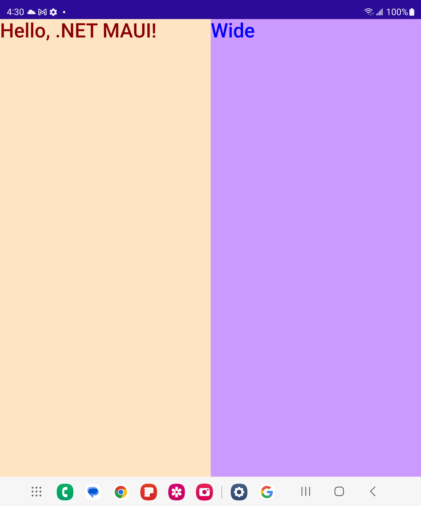

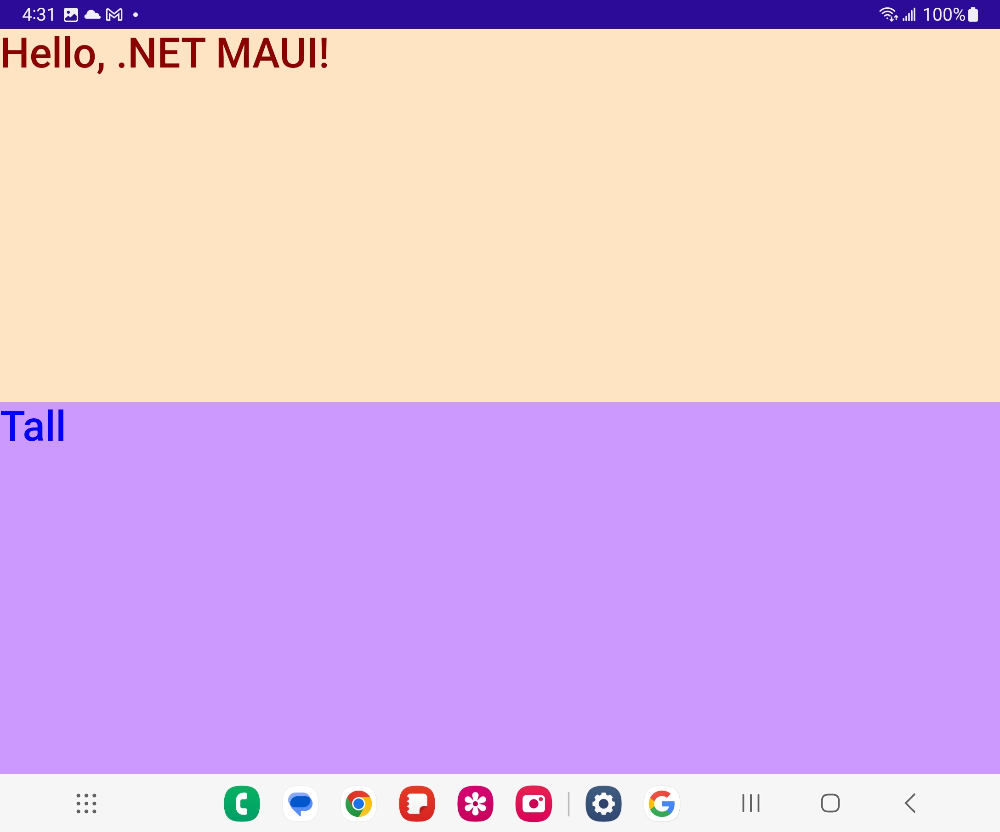

**Running on the Flip4:**

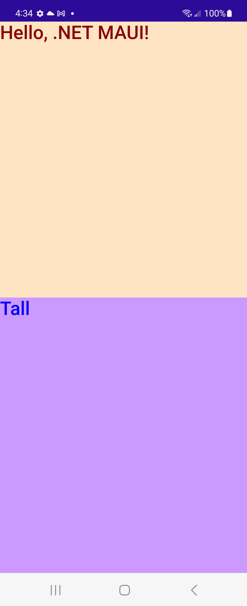

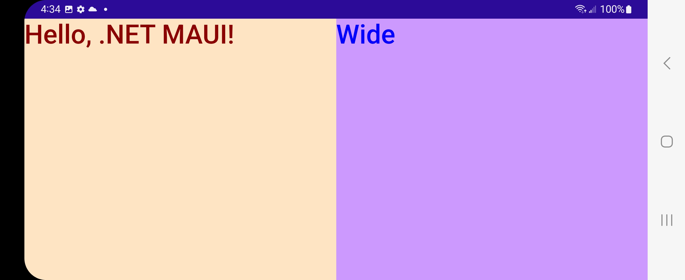


**Running on the Flip3!** (where the XAML control did not work):

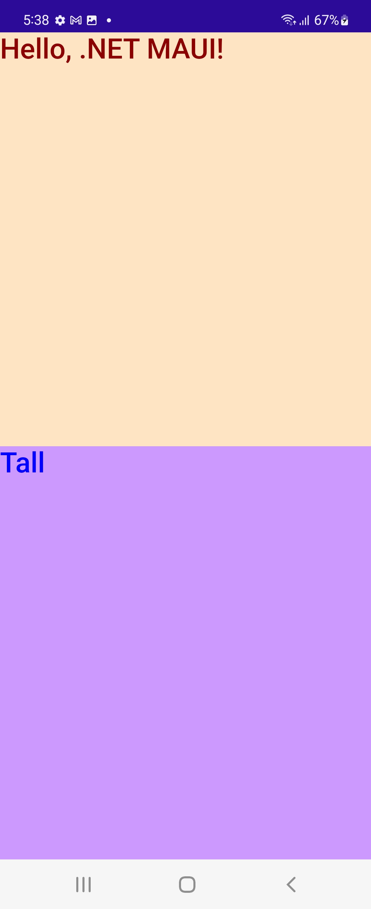

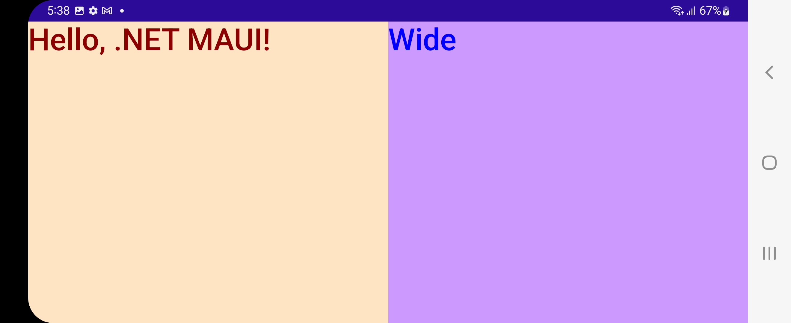

## Summary:

In this module:

1. We implemented the `TwoPaneView` in a **.NET MAUI XAML App**
2. We learned that `TwoPaneView` doesn't behave correctly on certain older devices, but we don't know if it fails only on my specific device, or on all Flip3 devices.
3. We learned that it DOES behave correctly on the newer Samsung Fold and Flip devices
4. We wrote a Blazor component that can be used in a **.NET MAUI Blazor App** to do the same thing that the `TwoPaneView` component does in XAML.
5. We learned that in order for it to work in Blazor, we have to change the Mode according to what type of device we're running on, which isn't a good long-term solution.

